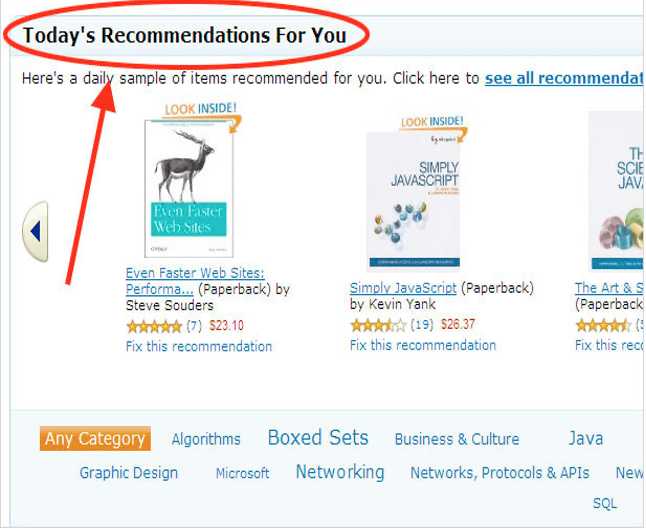
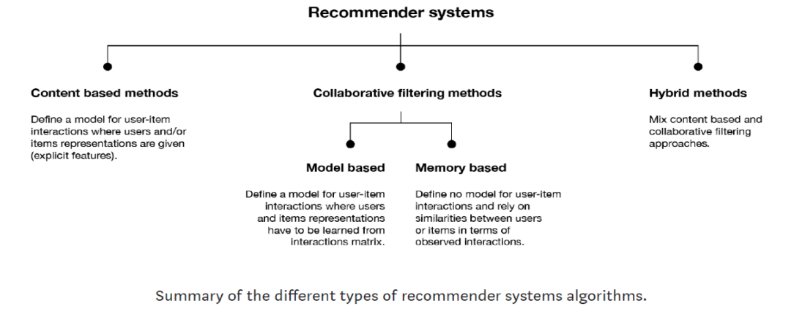
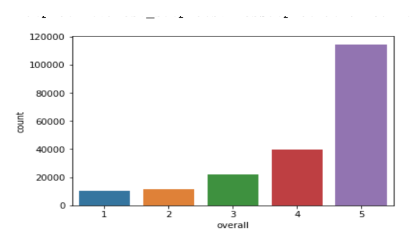

# Amazon-Product-Recommender-System

When we order some product in Amazon, we always get some product recommendations at the end. So how does the prediction happen according to our search. Recommendation systems help customers by suggesting likely list of products they can easily select the right one from. By offering competitive prices, features, delivery times etc. they make consumers aware of new and/or similar goods available for purchase.  Amazon recommender system gives a customized recommendation based on our profile and how does this is more effective than other ecommerce sites.

From this we are going to use small subsets of the data which is Product Reviews 
1.	Clothing, shoes and jewelry (3 lakh Reviews)
2.	Beauty (2 Lakh Reviews)

The reason behind choosing the dataset is its demand.
● Amazon has more than 29 million customers and several million catalog items.
● Amazon use recommendation algorithms to personalize the online store for each customer in real time.

Solution:
● Existing algorithm were evaluated over small data sets.
● Reduce M by randomly sampling the customers or discarding customers with few purchases. (M: the number of customers)
● Reduce N by discarding very popular or unpopular items. (N: the number of items)
● Dimensionality reduction techniques such as clustering.

<h1><B><U>Types of filtering:</U></B></h1>

Content Based Filtering: In content-based filtering, the similitude between various items is determined on the premise of the characteristics of the items. For example, in a content-based book recommender framework, the comparability between the books is determined based on classifications, the writer of the book, the distributer of the book, title of the book and so forth. 

Collaborative Filtering: The strategy finds a subset of clients who have comparable tastes and inclinations to the objective client and utilize this subset for offering proposals. 

Fundamental Assumptions: 
- Users with comparative interests have regular inclinations. 
- Sufficiently enormous number of client inclinations are accessible. 

Fundamental Approaches: 
- User Based 
- Item Based 

Item Based Collaborative Filtering:
- Better adaptability, since connections be tween’s set number of items rather than huge number of clients 
- Reduced sparsity issue 

<h1>Analysis:</h1>

In the Analysis part we are going to perform various steps like data cleaning, EDA and implementing algorithms and testing and validating on the samples.

As a first step, since the data we have taken is a raw unstructured data from amazon we are going to merge reviews of beauty and clothing and perform data cleaning and visualize them.

Data cleaning:
To bring the data into a reliable arrangement, steps taken are: 
1. Drop superfluous sections 
2. Drop copy records 
3. Check for invalid data 
4. Check ranges for relevant sections, (evaluations somewhere in the range of 1 and 5)
5. Manage missing qualities and exceptions 

Basically, we are going to predict or show recommendations based on user’s review and rating. 

Algorithms which are used in this project are LSTM and K-Nearest Neighbor. LSTM is done using neural network which is used for feature extraction from text and to predict the polarity of user’s review whether it is positive or negative. KNN is used for item based collaborative filtering and to return top recommendations based on product’s average review and rating.

The fields in the database are:
1.	Reviewer ID
2.	ASIN
3.	Reviewer Name
4.	Helpful
5.	Review Text
6.	Overall
7.	Summary
8.	Unix Review Time
9.	Review Time

The unique ID among the fields is ASIN which is Amazon standard Identification number which is a unique number to each product in the amazon based on ASIN we will implement and analyze recommender system.

<h1>LSTM</h1>
LSTM is Long short-term memory in deep learning and it is used as artificial recurrent neural network. Using nltk library from python (Natural language tool kit) we will implement this algorithm. We will use sentiment analysis approach in this algorithm.

As a first step we will import the necessary libraries and clean the data. Next step is to define a function to remove stopwords. Stopwords are common words which are used in the text like “the”,” a”, “an” these words mostly occupy 50% of our sentence. We wouldn't want these terms to take up space in our database and take so much time for processing in memory. Stopwords are there for 16 languages in python library so we will use English and remove these words. It is done by taking a review and converting them into lower case and split it and use stemming. This is done using nltk data dictionary library. Stemming is the process of combing similar words to its base or stem and treat them as a single value. So, it reduces space and time. 

<h1>KNN</h1>

KNN is used to find clusters of similar users based on common clothes or beauty product ratings and make predictions using the average ratings of top-k nearest neighbors. Collaborative filtering approach builds a model from user’s past behavior like items previously purchased or ratings of those items.

KNN relies on items feature similarity will calculate distance between the target product and every other product in the database and then ranks its distance and returns the top K nearest neighbor products as recommendations. 
